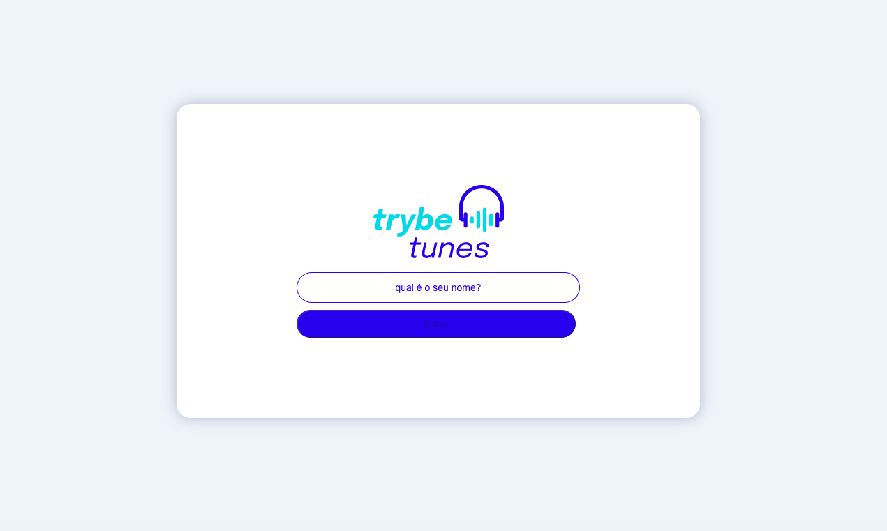
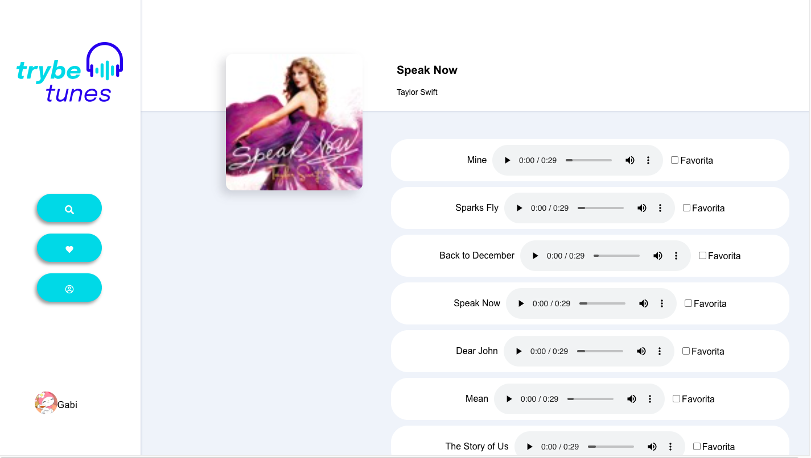

# TrybeTunes / [DEMO](https://gabinamu.github.io/TrybeTunes/#/)
Trybetunes is an application capable of playing songs from the most varied bands and artists, creating a list of favorite songs and editing the profile of the logged-in user. This application is capable of:
- Login;
- Search for a band or artist;
- List available albums by this band or artist;
- Preview songs in a selected album;
- Play a preview of songs from this album;
- Favorite and unfavorite songs;
- View favorite music list;
- View the profile of the logged in person;
- Edit the logged-in person's profile;

<div align="center" display="inline">





</div>

## Run Locally
- First clone the repository into your machine;

```
git clone git@github.com:GabiNamu/TrybeTunes.git
```
- Go to the project directory;

```
cd TrybeTunes
```

- Install dependencies;

```
npm install
```
- Start the server;
```
npm start
```
## Main technologies used:


## Collaboration:
- The src/services directory was made by Trybe;
